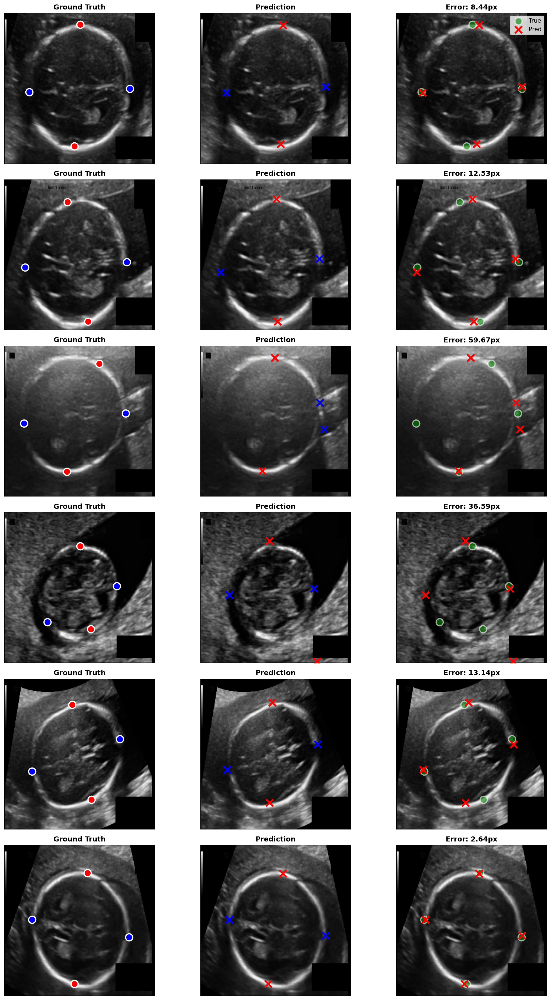
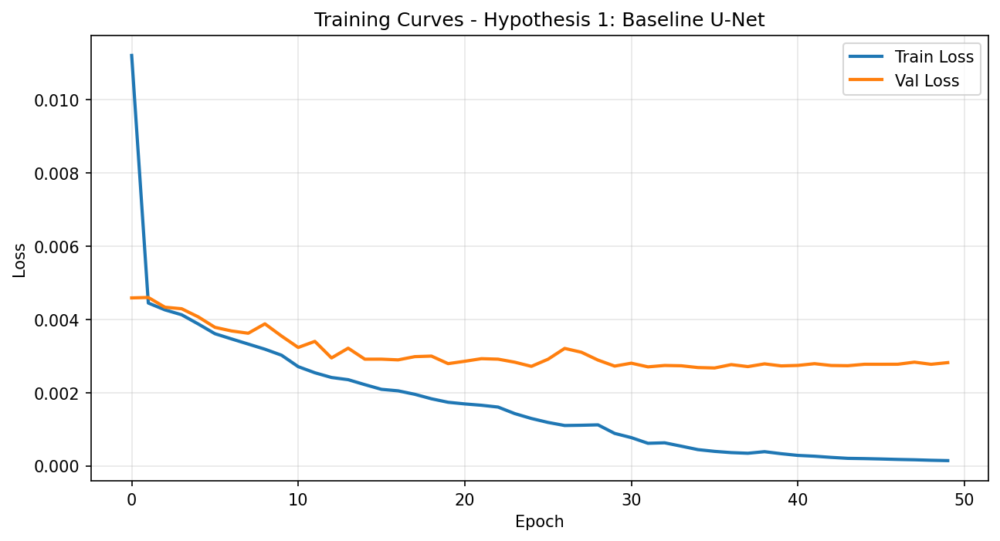

# 🔬 Fetal Ultrasound Biometry — Landmark Detection & Segmentation

**Author:** Bishwajit Prasad Singh  
**Date:** January 2026  
**Domain:** Medical Image Analysis · Deep Learning · Computer Vision

---

## 📌 Project Overview

This project tackles two core tasks in fetal ultrasound biometry using deep learning:

| Task | Goal | Dataset |
|------|------|---------|
| **Task 1 — Landmark Detection** | Detect BPD & OFD landmarks (4 keypoints per image) | 622 ultrasound images |
| **Task 2 — Segmentation** | Segment fetal structures from ultrasound scans | 622 ultrasound images |

A **hypothesis-driven approach** was used — multiple model architectures and training strategies were tested systematically, and the best-performing configuration was selected based on validation metrics.

---

## 🖼️ Visual Results

### Project Overview


### Task 1 — Landmark Detection


### Task 2 — Segmentation


### Training & Performance Comparison




---

## 📁 Repository Structure

```
fetal-ultrasound-biometry/
│
├── assets/                          # Portfolio & showcase images
│   ├── project-overview.png
│   ├── demos/                       # Demo visualizations
│   └── results/                     # Training & comparison plots
│
├── task_1_landmark/                 # Landmark Detection
│   ├── README.md                    # Task-specific documentation
│   ├── Python Script/               # Source code
│   │   ├── Trainer1.py              # Hypothesis 1 & 2 training
│   │   ├── Tester1.py               # Hypothesis 1 & 2 testing
│   │   ├── Trainer_Hypothesis3.py   # Hypothesis 3 training
│   │   └── Testing_Hypothesis3.py   # Hypothesis 3 testing
│   └── Report/                      # Task 1 report
│
├── task_2_segmentation/             # Segmentation
│   ├── README.md                    # Task-specific documentation
│   ├── Python Script/               # Source code
│   │   ├── Trainer.py               # Segmentation training
│   │   ├── Tester.py                # Segmentation testing
│   │   └── Assets/
│   │       └── utils.py             # Shared utilities
│   └── Report/                      # Task 2 reports & PDF
│       ├── FINAL_SUMMARY_REPORT.txt
│       ├── hypothesis_2_detailed_report.txt
│       └── Report.pdf
│
├── models/                          # Trained model weights
│   ├── landmark/                    # 4 landmark model checkpoints
│   └── segmentation/                # 8 segmentation model checkpoints
│
├── outputs/                         # All generated visualizations
│   ├── landmark_results/            # 12 landmark output images
│   └── segmentation_results/        # Segmentation output images & logs
│
├── reports/                         # Project-wide documentation
│   └── landmark_and_segmentation_reports/
│       └── ReadMe_Complete.txt      # Complete project documentation
│
├── requirements.txt                 # Python dependencies
├── .gitignore                       # Git ignore rules
└── README.md                        # This file
```

---

## 🧪 Hypothesis-Based Approach

Both tasks were solved using a structured experimental methodology:

**Task 1 — Landmark Detection (BPD & OFD)**
- **Hypothesis 1:** Baseline CNN architecture for 4-landmark detection
- **Hypothesis 2:** Fixed/improved variant with training adjustments
- **Hypothesis 3:** ResNet-based encoder architecture

**Task 2 — Segmentation**
- **Hypothesis 1:** First segmentation architecture
- **Hypothesis 2:** Refined architecture (detailed report available)
- **Hypothesis 3:** Third experimental variant
- **Final:** Best configuration selected from all hypotheses

Each hypothesis produced its own trained model, training curves, and evaluation results — all stored in `models/` and `outputs/`.

---

## 🚀 Getting Started

### 1. Clone the Repository
```bash
git clone https://github.com/YourUsername/fetal-ultrasound-biometry.git
cd fetal-ultrasound-biometry
```

### 2. Create Virtual Environment
```bash
python -m venv venv
# Windows:
venv\Scripts\activate
# Linux/Mac:
source venv/bin/activate
```

### 3. Install Dependencies
```bash
pip install -r requirements.txt
```

### 4. Run Landmark Detection
```bash
cd task_1_landmark\Python Script
python Trainer1.py          # Train Hypothesis 1 & 2
python Tester1.py           # Test Hypothesis 1 & 2
python Trainer_Hypothesis3.py    # Train Hypothesis 3
python Testing_Hypothesis3.py   # Test Hypothesis 3
```

### 5. Run Segmentation
```bash
cd task_2_segmentation\Python Script
python Trainer.py           # Train segmentation models
python Tester.py            # Test & evaluate
```

---

## 📊 Reports & Documentation

| Document | Location | Description |
|----------|----------|-------------|
| Complete Project Doc | `reports/landmark_and_segmentation_reports/ReadMe_Complete.txt` | Full project documentation |
| Segmentation Summary | `task_2_segmentation/Report/FINAL_SUMMARY_REPORT.txt` | Segmentation final results |
| Hypothesis 2 Detail | `task_2_segmentation/Report/hypothesis_2_detailed_report.txt` | Detailed H2 analysis |
| Segmentation Report PDF | `task_2_segmentation/Report/Report.pdf` | Formatted report |

---

## 🛠️ Tech Stack

- **PyTorch** — Deep learning framework
- **Torchvision** — Model architectures & data transforms
- **OpenCV / Pillow** — Image loading & processing
- **NumPy / Pandas** — Data handling
- **Matplotlib / Seaborn** — Visualization
- **Scikit-learn** — Metrics & evaluation

---

## 📝 Notes

- All model weights are stored in `models/` — these are `.pth` PyTorch checkpoint files
- Full experimental outputs (training curves, prediction visualizations, error analysis) are in `outputs/`
- Portfolio-ready images are pre-selected in `assets/`

---

*Built as part of a structured medical image analysis project — January 2026*
